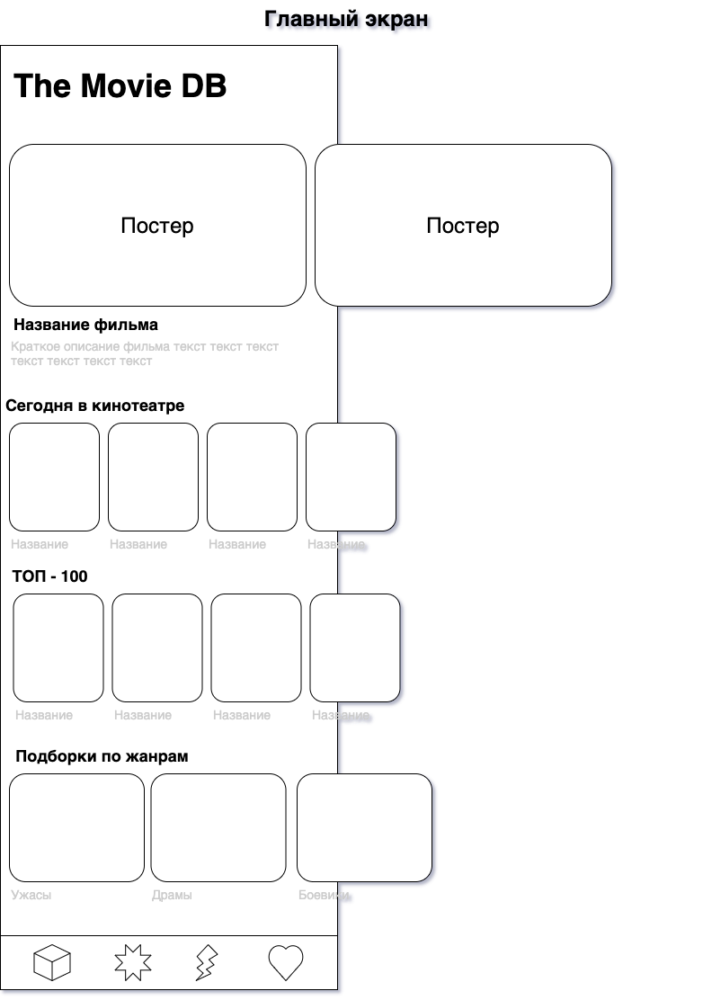
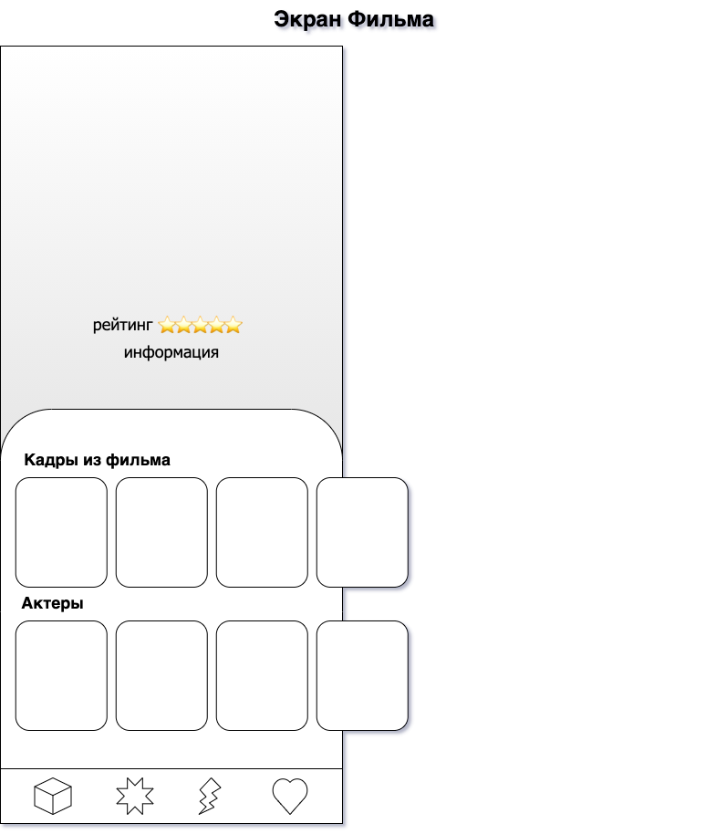
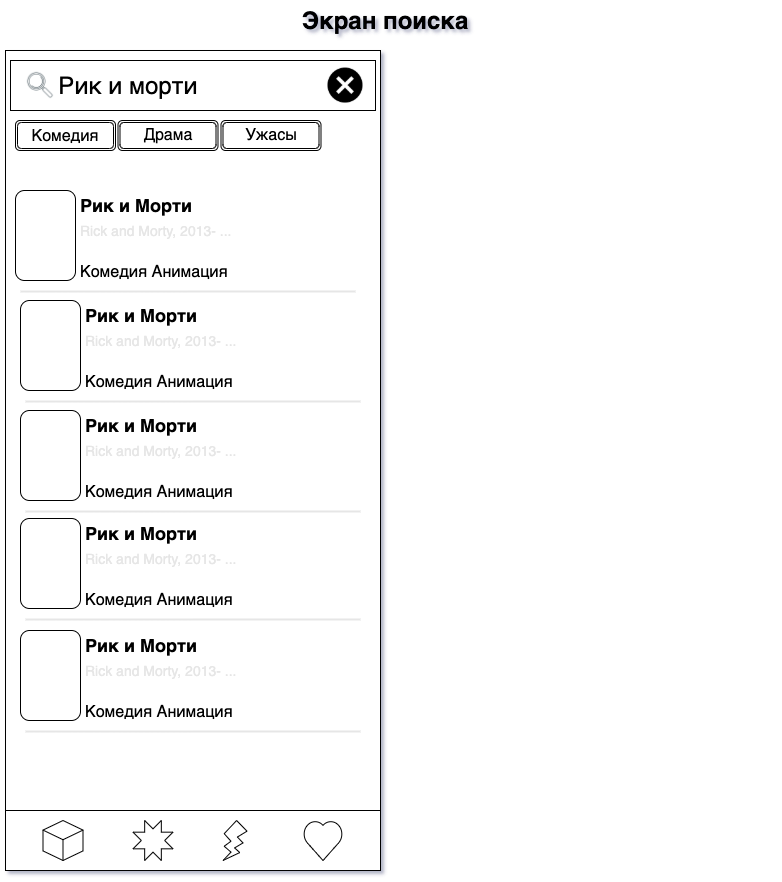
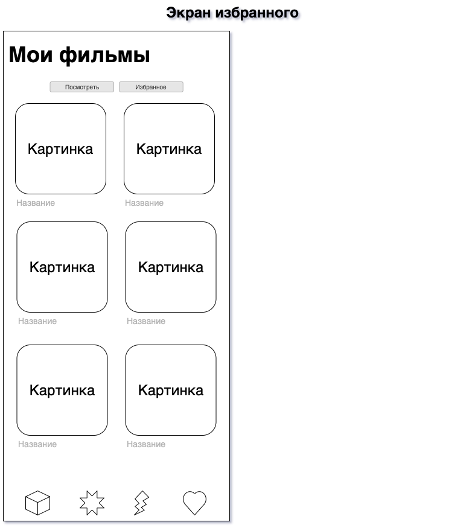

# TheMovieDB / Киношечка

## Описание

### Общее

Приложение предстовляет из себя клиент для популярного интернет-сервис о кино The Movie Database (**TMDB**). Поиск фильмов, новости кино, отзывы пользователей, афиша кинотеатров, фотографии, постеры, трейлеры, кассовые сборы и многое другое.

### Экраны

#### Главный

Главный экран представляет из себя подобие "dashboard" где распологаются несколько "каруселей", Примерный состав: "сегодня в кино", "ТОП - 10/100/1000" (фильмы и сериалы), подборки по жанрам. По клику на каждый из элементов - переход на детальный экран.

#### Детальная информация о фильме/сериале

Экран детальной информации состоит из верхней части с больший изображением (постер или кадр) поверх накладывается краткая информация (жанр, рейтинг и т.д.), В нижней части рапологаются две "карусели": актеры и кадры, ниже идет подробная информация.

#### Поиск

Экран для поиска фильмов и сериалов, содержит часть для пользовательского ввода и таблицу с результатами поиска (картинка, название, жанр и год).

#### Мои фильмы

Экран для просмотра пользовательских фильмов, сожет быть 2 списка: "к просмотру" и "избранное".

## Модели данных

### Кинопроизведение

* ID
* Название
* Слоган
* Дата выхода
* [Жанр]
* Главное изображение
* [Кадры]
* Описание
* Рейтинг
* Статус (вышел или не вышел)
* Старна

## Источник данных
[TheMovieDB](https://www.themoviedb.org/documentation/api)

## Зависимости 

- iOS 13+
- Xcode 11.7+
- Swift 5

