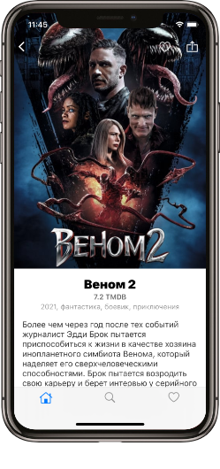
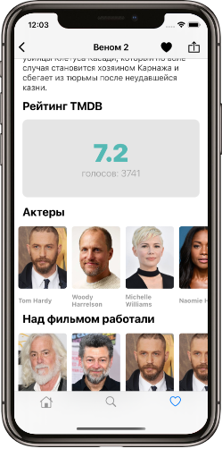
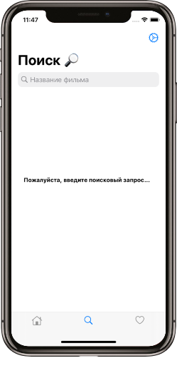
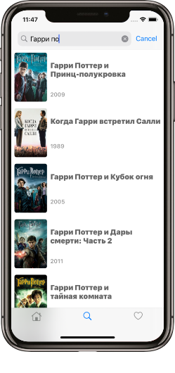
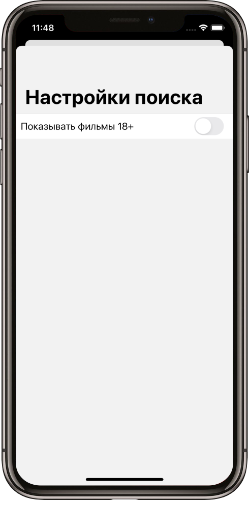
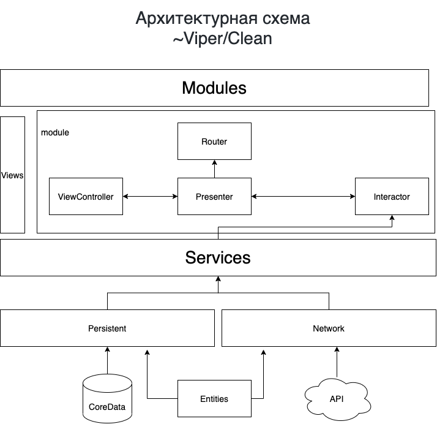

# TheMovieDB / Киношечка

## Описание

### Общее

Приложение предстовляет из себя клиент для популярного интернет-сервис о кино The Movie Database (**TMDB**). Поиск фильмов, афиша кинотеатров, постеры, кассовые сборы и многое другое.

### Экраны

#### Главный

Главный экран представляет из себя подобие "dashboard" где распологаются несколько "каруселей". Состав:  Тренды, сейчас в кино и популярные сериалы. По клику на каждый из элементов - переход на детальный экран.

#### Детальная информация о фильме/сериале

Экран детальной информации состоит из верхней части с больший изображением (постер или кадр) далее информация (жанр, рейтинг и т.д.), В нижней части рапологаются две "карусели": актеры и над фильмом работали.

#### Поиск

Экран для поиска фильмов, содержит часть для пользовательского ввода и таблицу с результатами поиска (картинка, название и год). Над строкой поиска распологается кнопка вызова настроек, которые храняться UserDefaults.

#### Избранное

Экран для просмотра фильмов добавленных в избранное. Можно удалить свайпом. В углу располагается кнопка для отчистки всех записей. Для хранения успользуется CoreData. 

## Модели данных

### Кинопроизведение

* ID
* Название
* Слоган
* Дата выхода
* [Жанр]
* Главное изображение
* Описание
* Рейтинг

## Источник данных
[TheMovieDB](https://www.themoviedb.org/documentation/api)

## Архитектурная схема

## Точки роста
* Больше декомпозиции в модулях (**S**OLID)
* Внедрение builder/assembly etc
* Внедрение координатора
* Декомпозиция TMDBNetworkService на TMDBService и NetworkService 

## Зависимости 

- iOS 13+
- Xcode 12.0+
- Swift 5

